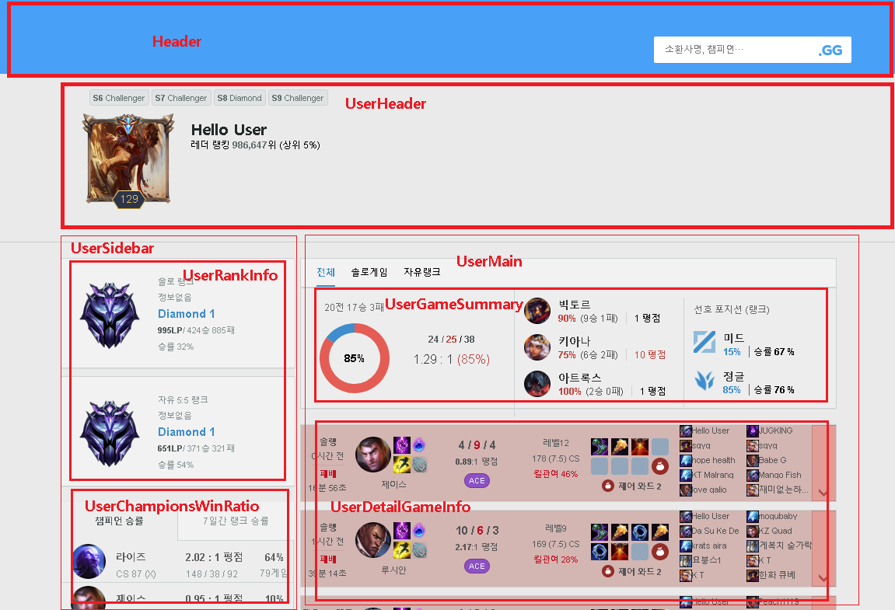

</img>

# 리그오브레젠드 전적검색 앱

creact-react-app으로 제작된 리그오브레젠드 전적검색 앱입니다\
`https://lol.devkr.info`를 통해서도 이용할 수 있습니다\
\
`https://도메인이름/user/{username}` 으로 접속하면 {username}에 입력한 유저정보를 바로 확인할 수 있습니다

### 웹앱 구동환경

이 앱은 다음의 데스크톱 환경에서 작동이 확인되었습니다\
\
OS : Windows 10\
웹브라우저 : 크롬 97.0.4692.71, MS Edge 97.0.1072.62\
\
OS : macOS Monterey\
웹브라우저 : 사파리 15.2\
\
OS : Ubuntu 20.04.3 LTS\
웹브라우저 : 파이어폭스 96.0

---

### node.js에서 구동하기

이 앱을 node.js에서 구동하려면 node.js 버전 `16.13.1`이 필요합니다\
npm을 쓰는경우 커맨드라인에서 `npm i` 입력후 `npm run dev`를 입력한다\
또는 `npm i` 입력후 `npm run d`를 입력한다\
\
yarn을 쓰는경우 커맨드라인에서 `yarn 입력후` `yarn dev`를 입력한다\
또는 `yarn` 입력후 `yarn d`를 입력한다

---
## Perforomance

1. FCP : 706 ~ 1412ms
1. TTFB : 19 ~ 337ms
---

## 컴포넌트 설명

</img>

## 참고사항

1. 최근검색 항목 및 즐겨찾기 데이터는 localstorage에 저장됩니다
1. autocomplete 데이터는 `http://lol-api.devkr.info`를 경유하여 `https://www.op.gg/ajax/autocomplete.json`에서 응답받습니다
1. `http://lol-api.devkr.info`는 오토컴플리트 API의 프록시 서버이며 상세 코드는 루트 디렉토리의 `fastify-server-for-autocomplete` 폴더에 있습니다.\
이 서버는 AWS 서울 리전의 EC2에 배포되었습니다

---

## Further Study

1. CRA에서 Qwik로 마이그레이션 하여 랜딩페이지 로딩 속도를 개선할 수 있을 것으로 보임