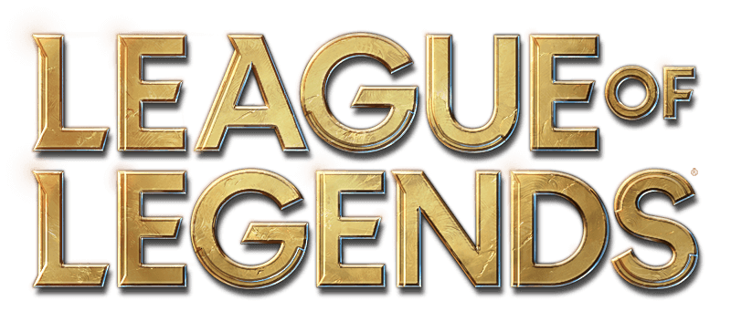

</img>

# 리그오브레젠드 전적검색 앱

creact-react-app으로 제작된 리그오브레젠드 전적검색 앱입니다\
`https://lol.devkr.info`를 통해서도 이용할 수 있습니다
### 웹앱 구동환경

이 앱은 다음의 환경에서 정상작동이 확인되었습니다\
\
OS : Windows 10\
웹브라우저 : 데스크탑용 크롬 버전 97.0.4692.71 및 MS Edge 버전 97.0.1072.62에서 정상작동 확인\
\
OS : Ubuntu 20\
웹브라우저 : 파이어폭스에서 정상작동 확인

---

### node.js에서 구동하기

이 앱을 node.js에서 구동하려면 node.js 버전 `16.13.1`이 필요합니다\
npm을 쓰는경우 커맨드라인에서 `npm i` 입력후 `npm run dev`를 입력한다\
또는 `npm i` 입력후 `npm run d`를 입력한다\
\
yarn을 쓰는경우 커맨드라인에서 `yarn 입력후` `yarn dev`를 입력한다\
또는 `yarn` 입력후 `yarn d`를 입력한다

---

# TODO

1. 이미지에 alt 추가할것

1. 재랜더링하면d3가 지우고 다시 그리게 할 것

1. d3에 10 10이 들어가면 에러가 나는듯 보임

## 없는 기능 구현

1. Header - 검색창 클릭시 히스토리 나오게끔 수정
1. Header - 검색창 입력시 autocomplete json 리퀘스트 요청하기
    1. Header - ajax/autocomplete.json이 크로스오리진 요청에 응답안함

1. SideBar Summary - "탑 (총 27게임)" 부분에 들어갈 데이터 찾기

1. SideBar Champion - 챔피언 정렬하여 화면에 뿌려주기
1. SideBar Champion - 챔피언 승률 요약 화면 그리기
1. SideBar Champion - 분당 CS 데이터를 어디에서 받아오는지 확인할 것

1. SideBar Champion Summary - 챔피언 승률 요약 화면 그리기
1. SideBar Champion- "7일간 챔피언 승률"을 클릭시에 새로운 챔피언 리스트 렌더링하기

1. UserMain Summary - "솔로게임" 카테고리 클릭시 데이터 필터링하기
1. UserMain Summary - svg의 원형 그래프 구현
1. GameDetail - 아이템 호버링시 tooltip 구현하기
1. GameDetail - 날짜(하루전)을 제대로 구현하기

---

## UI 구현

1. UserMain Summary - "선호 포지션"란에서 포지션 아이콘을 구해올것

1. GameDetail - 챔피언 영어명을 한글로 맵핑하기
1. GameDetail - 룬 이미지 삽입하기
1. GameDetail - KDA에 NaN이라고 나올때 있음. 수정하기 (아마도 death가 0일때 0으로 나눠서 그런듯)
1. GameDetail - "더블킬, 트리플킷"을 이미지화하고 "ACE"도 이미지화하기ㅣ

1. GameDetail - 아이템 리스트에서 empty item을 그리기
1. GameDetail - 팀원 정보에서 창 칸을 넘어가는 경우 ...로 표기하기
